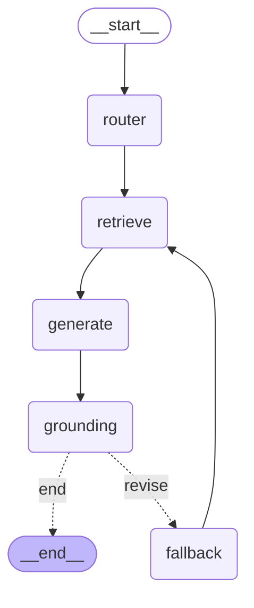

# Architecture — Repo Expert

Agentic RAG that answers questions about a GitHub repository with inline citations.
One codebase; two instances selected by config (`public`, `portfolio`). This document
describes the components, the data flow, the agent graph, the three knowledge sources,
and the key design decisions.

---

## 1. Build-vs-buy boundary

The headline design choice (Option C) splits the system into a *bought* managed
retrieval layer and a *built* reasoning + ingestion layer.

| | Component | Responsibility |
|---|---|---|
| **Buy** | Qdrant Cloud (managed vector store + free server-side inference) | Vector storage and similarity search over our collections; embeddings produced server-side from `models.Document` (no embedding model in our process). |
| **Build** | Custom code-aware chunking + collections | Symbol-level code chunks and section-level markdown chunks, upserted by us with stable ids. |
| **Build** | Cross-collection fusion | Reciprocal Rank Fusion over the docs/code/career collections, so code (which scores lower on cosine for NL queries) is not starved. |
| **Build** | LangGraph orchestration | Router → retrieve → generate → grounding → fallback. The corrective/self-grounding loop is ours — the CV-relevant piece. |
| **Build** | Live GitHub issues tool | Issues/PRs queried live via the GitHub Search API, outside the vector store (public instance only). |

Rationale: the agentic *reasoning* (routing, fallback, self-correction) and the retrieval
*fusion* live in our LangGraph + retriever, not in the managed service. Qdrant is a strong
vector store; the agent is the brain.

> **Migration note (Phase 7):** retrieval moved off Azure AI Search / Foundry IQ to Qdrant
> Cloud to cut recurring cost from ~$75+/mo to ~$0–1/mo for a low-traffic personal-brand
> site. The interfaces (`retrieve_kb`, `RetrievalResult`, the agent, the API) were
> unchanged; only the ingestion upsert and the `kb` retriever were rewired.

---

## 2. Components

```
                          ┌──────────────────────────────┐
   repo-expert ingest     │        Ingestion (build)     │
   ───────────────────▶   │  fetch → chunk →             │
                          │  upsert (server-side embed)  │
                          └───────────────┬──────────────┘
                                          │ writes
                                          ▼
                          ┌──────────────────────────────┐
                          │      Qdrant Cloud (buy)      │
                          │  docs · code · career        │
                          │  collections (vector search, │
                          │  free server-side inference) │
                          └───────────────┬──────────────┘
                                          │ retrieves (RRF fuse)
   POST /ask              ┌───────────────▼──────────────┐      ┌────────────────────┐
   ───────────────────▶   │   LangGraph agent (build)    │ ───▶ │ GitHub issues API  │
                          │  router → retrieve →         │ live │ (public instance)  │
   FastAPI backend        │  generate → grounding →      │ tool └────────────────────┘
                          │  fallback loop               │
                          └───────────────┬──────────────┘
                                          │ uses
                                          ▼
                          ┌──────────────────────────────┐
                          │       Azure OpenAI (buy)     │
                          │  routing · generation ·      │
                          │  grounding judge (gpt-4o-mini)│
                          └──────────────────────────────┘
```

| Module | Path | Role |
|---|---|---|
| Config | `src/repo_expert/config/` | `Settings` (env/secrets) + `InstanceConfig` (the only thing that differs per instance). |
| Ingestion | `src/repo_expert/ingestion/` | `pipeline.ingest`: fetch repo → chunk docs/code/career → upsert into Qdrant (server-side embedded). `qdrant_collections` provisions collections; `qdrant_upload` upserts; `qdrant_embed` wraps text as `models.Document`. |
| Retrieval | `src/repo_expert/retrieval/` | `registry` resolves active retrievers; `kb` (Qdrant vector search + RRF) + `issues` (live GitHub). |
| Agent | `src/repo_expert/agent/` | LangGraph `graph` + `agent.ask` entrypoint. |
| API | `src/repo_expert/api/` | FastAPI app exposing `GET /health` and `POST /ask`. |
| CLI | `src/repo_expert/cli.py` | `repo-expert provision`, `ingest`, and `eval`. |
| Eval | `src/repo_expert/eval/` | Retrieval-relevance + groundedness harness and report writer. |

---

## 3. Data flow

### Ingestion (`repo-expert ingest`)
1. **Provision** the Qdrant collections for the instance (`qdrant_collections.py`).
2. **Fetch** each target repo (`ingestion/fetch.py`).
3. **Chunk** — markdown by section (`markdown.py`), code by symbol with code-aware
   chunking (`code.py`), career doc by entry (`career.py`, portfolio only). Path globs
   from `InstanceConfig` control scope and embedding cost.
4. **Upsert** into Qdrant (`qdrant_upload.py`): each chunk becomes a point whose vector is
   a `models.Document`, so Qdrant embeds the text **server-side** at upsert time. Stable
   sha1→UUIDv5 point ids make re-ingest an upsert, not a duplicate insert.

### Query (`POST /ask`)
1. **router** — picks the minimal set of sources (`kb`, `issues`) for the question.
   Single-source instances skip the LLM call.
2. **retrieve** — runs each routed retriever (`top=6`). KB runs vector search over the
   Qdrant collections (server-side embedded query) and fuses them with **RRF**; issues
   hits the live GitHub Search API (with an LLM query-rewrite to keywords).
3. **generate** — answers using only the numbered sources, citing inline as `[n]`.
   The instance `scope_prompt` (if any) is appended to scope answers.
4. **grounding** — an LLM verifies every claim is supported by the sources.
5. **fallback** — if ungrounded and attempts remain, widen the route to all sources and
   loop back to retrieve. Otherwise end.

---

## 4. Agent graph

Source: `docs/agent-graph.mmd` (regenerate with `agent.export_graph`).



The corrective loop (`grounding → fallback → retrieve`) runs at most `MAX_ATTEMPTS = 2`
times before answering with the best draft.

---

## 5. The three heterogeneous knowledge sources

Two sources are shared; the third is swapped per instance via `InstanceConfig.source3`.

| # | Source | Kind | public instance | portfolio instance |
|---|---|---|---|---|
| 1 | Docs / markdown | section-chunked text, in Qdrant | FastAPI English docs + README | Markdown across Jorge's portfolio repos |
| 2 | Source code | symbol-chunked code, in Qdrant | `fastapi/**/*.py` | Python across portfolio repos |
| 3 | **Swapped** | — | **GitHub issues/PRs**, live via API, outside Qdrant | **Career KB**, a local markdown doc indexed into Qdrant |

- The third source differs in *kind*, not just content: a **live API tool** vs an
  **indexed knowledge source**. This satisfies the class requirement of ≥3 heterogeneous
  sources while exercising both the build (live tool) and buy (indexed) paths.
- In the portfolio instance the career doc (`docs/jorge-pulgar-career-rag.md`) is folded
  into a third Qdrant collection, so the registry registers no separate retriever — routing
  collapses to `kb` only and the agent skips the router LLM call.

---

## 6. Config-driven targeting

Switching instance = changing config, not code. `InstanceConfig` (`config/instance.py`)
selects:

- `target_repos` — which repo(s) to ingest and answer about.
- `docs_index` / `code_index` / `source3_index` — which Qdrant collections to use.
- `source3` — `issues` (live) or `career_kb` (indexed).
- `docs_globs` / `code_globs` / `exclude_globs` — ingestion scope (cost control).
- `scope_prompt` — optional guardrail appended to generation (portfolio declines
  off-topic questions).

Everything downstream (ingestion, retrieval, agent, API health) reads from this object
and stays instance-agnostic. Active instance is chosen by `REPO_EXPERT_INSTANCE` or the
`--instance` CLI flag.

---

## 7. Key decisions

- **Managed vector store, built fusion.** Qdrant stores and searches; the agentic headline
  (routing, RRF fusion, fallback, grounding) stays in our code so it is demonstrably *ours*.
- **Server-side embeddings (free tier).** Chunks/queries are sent as `models.Document` and
  embedded by Qdrant Cloud Inference, so no embedding model runs in our process or image.
  The free tier serves `all-MiniLM-L6-v2` (384-dim); the richer `mxbai-embed-large-v1` is
  not permitted on the free tier (P7-T2 gate), so MiniLM is the accepted fallback.
- **RRF over raw-score merge.** Code chunks score lower than prose on cosine for NL
  queries; a global score sort starves them, so collections are fused by rank — lifted
  code relevance 0.6 → 1.0 on the public eval.
- **Issues query-rewrite.** The GitHub Search API ANDs terms and returns nothing for
  prose, so questions are condensed to keywords first — lifted issue relevance 0.0 → 1.0.
- **Self-grounding over blind generation.** An independent LLM check gates answers; a
  weak draft triggers a wider retrieval pass before responding.
- **Career KB folded into a collection** (not a live tool) for the portfolio instance,
  because career content is static and benefits from vector retrieval.
- **Fail-fast settings.** Missing required env vars raise at load with the offending
  variable named.

---

## 8. Tech stack

Python 3.12 · uv · FastAPI · LangGraph · Qdrant Cloud (vector search + free server-side
inference, `all-MiniLM-L6-v2`) · RRF fusion · Azure OpenAI `gpt-4o-mini` (routing +
generation + grounding judge) · GitHub Search API. Deployed on Hugging Face Spaces (free).
See `README.md` for setup and run instructions.
